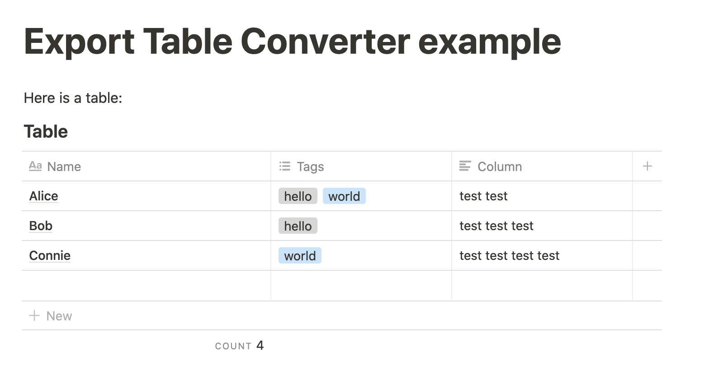
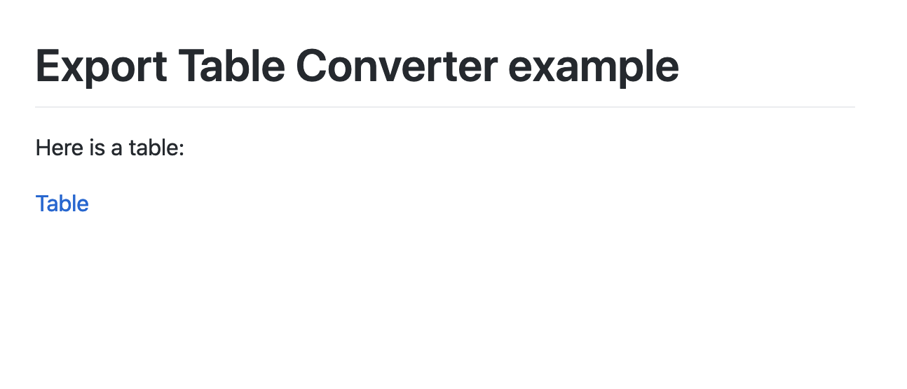
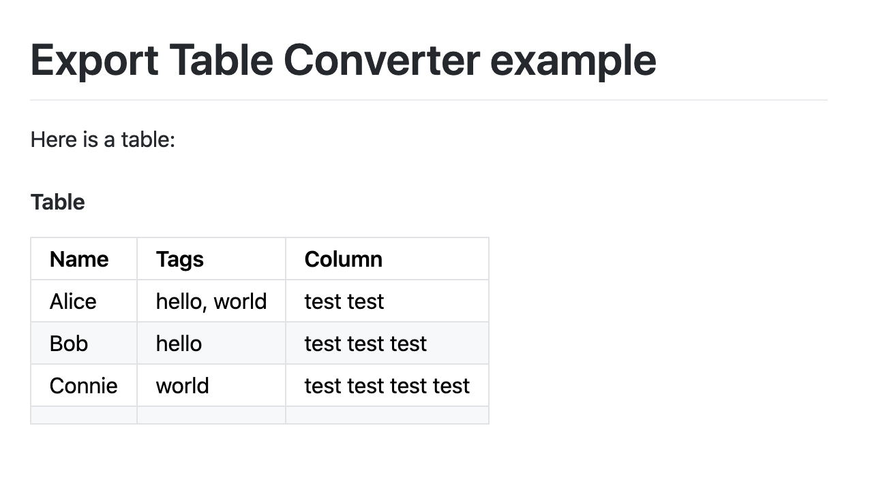

# Notion Export Table Converter
> (Working title)

It's convenient that Notion allows for markdown export, but it unfortunately
cannot turn tables into Markdown.  Instead, Notion's export creates a zip that
includes tables as CSV files.

The Notion Export Table Converter script processes this zip file and inserts Markdown
tables from the CSV

| Original Notion doc | Markdown export | Markdown export with Notion Export Table Converter |
|:--|:--|:--|
|  |  | |

To convert your page, click the options in the upper-right in Notion and pick "Export." The export format must be "Markdown & CSV" and **include subpages must be enabled.** If subpages are not included, the data for the tables will not be accessible.

Then you can run the script to convert tables:

```sh
# do one of these depending on your package manager
$ npm install -g notion-export-table-converter
$ yarn global add notion-export-table-converter

# now pass in the zip file (no need to extract) that you wish to convert
$ notion-export-table-converter ~/Downloads/Export-9d5fe382-4528-46ab-b443-d67e55299ced.zip > converted.md
```
